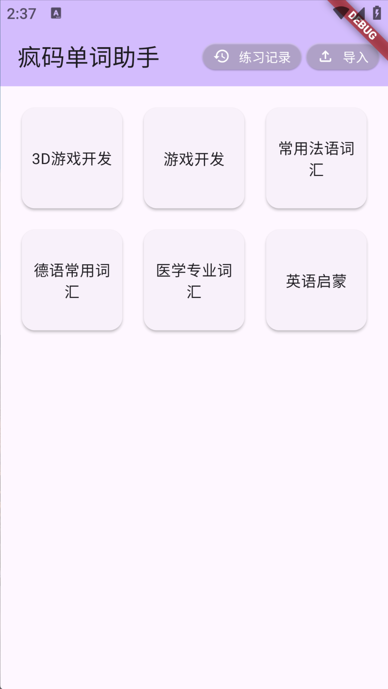
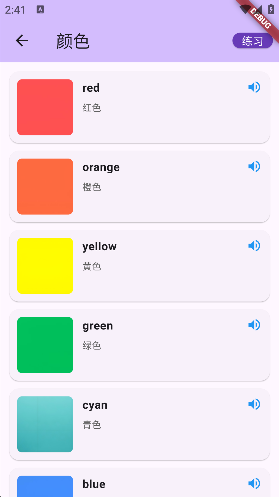
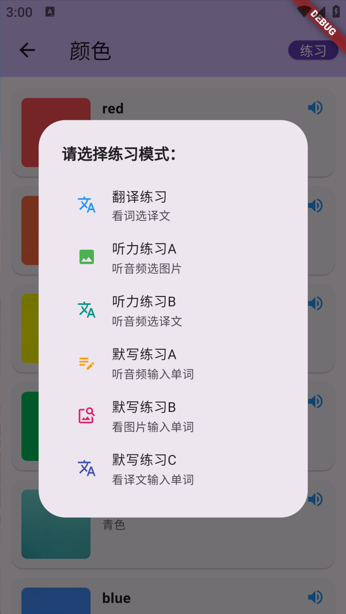
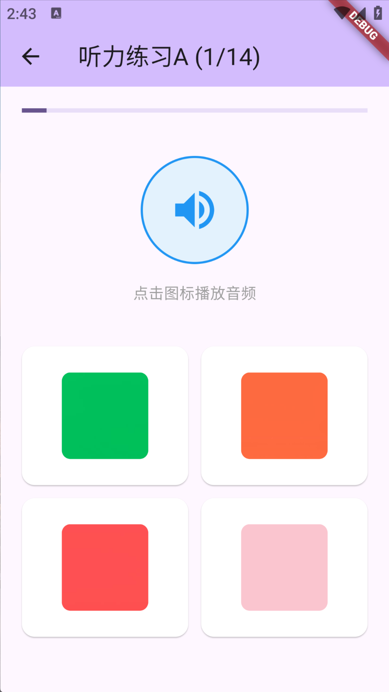
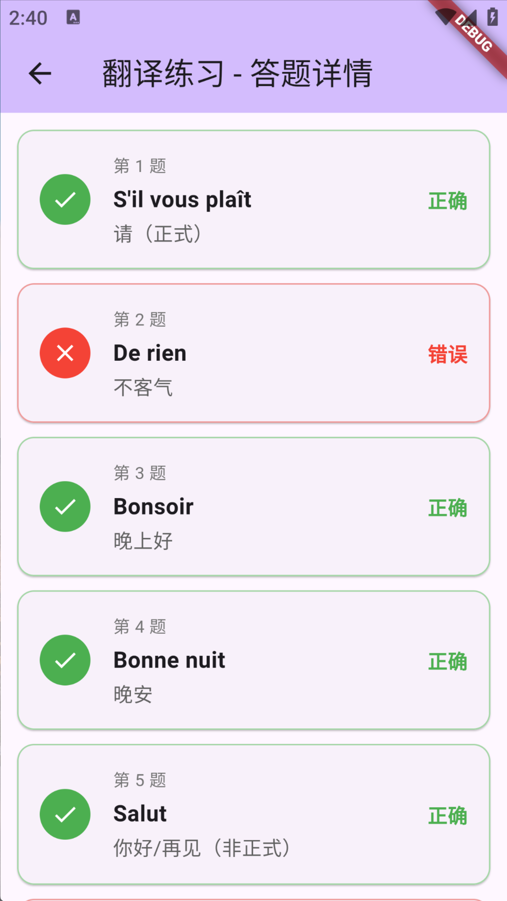
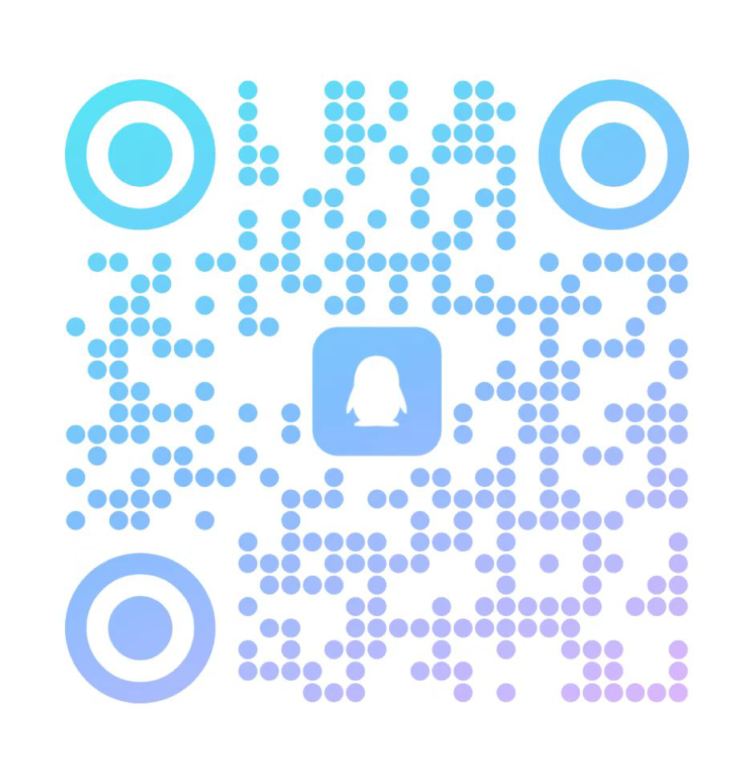

# Crazy Code Word Helper

A cross-platform vocabulary learning app built with Flutter, supporting Android, iOS, Windows, macOS, Linux, and Web. Features a three-level structure (Folder → Category → Word) with multiple practice modes to boost memorization.

## Features

- **Three-Level Word Bank Management**: Folder grid navigation → Category list → Word details, clean and organized
- **Multimedia Support**: Each word can have an associated audio file (listening) and image (visual memory)
- **Batch Import**: Select a folder containing a JSON file + media files to import a complete word bank in one go
- **Six Practice Modes**:
  - Translation Practice (view learn-word, choose my-word)
  - Listening Practice A (listen to audio, choose image)
  - Listening Practice B (listen to audio, choose my-word)
  - Dictation Practice A (listen to audio, type learn-word)
  - Dictation Practice B (view image, type learn-word)
  - Dictation Practice C (view my-word, type learn-word)
- **Practice Records**: Automatically saves accuracy rate and per-question details for each practice session, with full history review
- **Local Data Storage**: Powered by SQLite, all data stays on device with no internet required

## Screenshots

| Home | Word List | Practice Menu |
|:---:|:---:|:---:|
|  |  |  |

| Listening Practice | Practice History | History Detail |
|:---:|:---:|:---:|
|  |  |  |

## Installation

1. Make sure you have [Flutter](https://docs.flutter.dev/get-started/install) installed
2. After cloning the repo, run:
   ```bash
   flutter pub get
   flutter run
   ```
3. Build for release:
   ```bash
   flutter build apk        # Android
   flutter build ios        # iOS (requires macOS + Xcode)
   flutter build windows    # Windows
   flutter build macos      # macOS
   ```

## Direct Download

| Scan to Download |
|:---:|
|  |

## Data Import

The app supports batch importing word banks via a JSON file. The JSON can specify relative paths for audio and image files, which will be automatically copied to the app's cache directory during import.

### JSON Format Template

```json
{
  "name": "Game Development",
  "version": "1.0",
  "categories": [
    {
      "id": "general",
      "name": "General Game Dev Terms",
      "terms": [
        {
          "abbreviation": "",
          "learn_word": "Game Loop",
          "my_word": "游戏循环",
          "description": "The core loop that updates logic and rendering every frame",
          "audio": "game_loop_en.mp3",
          "image": "game_loop.png"
        }
      ]
    },
    {
      "id": "programming",
      "name": "Programming (General)",
      "terms": [
        {
          "abbreviation": "",
          "learn_word": "Variable",
          "my_word": "变量",
          "description": "Used to store data",
          "audio": "variable_en.mp3",
          "image": "variable.png"
        }
      ]
    }
  ]
}
```

### Field Description

| Field | Description |
|-------|-------------|
| `name` | Word bank name (used as the root folder name) |
| `categories` | Array of categories, each becomes a subfolder |
| `id` | Unique category identifier |
| `name` | Category display name |
| `terms` | Array of words |
| `abbreviation` | Abbreviation (optional) |
| `learn_word` | The word to learn |
| `my_word` | Native language translation |
| `description` | Additional description (optional) |
| `audio` | Relative path to audio file (must not be empty; use a placeholder filename if no audio) |
| `image` | Relative path to image file (must not be empty; use a placeholder filename if no image) |

### Quickly Generate a Word Bank

You can use AI tools like DeepSeek or ChatGPT to generate word bank data. Example prompt:

> Please compile 30 common German words and generate them in the following JSON format:
> ```json
> {
>   "name": "German Basic Vocabulary",
>   "version": "1.0",
>   "categories": [
>     {
>       "id": "daily",
>       "name": "Daily Life",
>       "terms": [
>         {
>           "abbreviation": "",
>           "learn_word": "Haus",
>           "my_word": "房子",
>           "description": "Noun, neuter",
>           "audio": "haus_de.mp3",
>           "image": "haus.png"
>         }
>       ]
>     }
>   ]
> }
> ```
>
> Make sure `audio` and `image` are not empty; use English filenames.

Put the JSON file and all media files in the same folder, then tap the "Import" button on the app's home screen and select that folder.

## Contact

Feel free to reach out if you have any questions or suggestions:

| WeChat | QQ |
|:---:|:---:|
|  |  |

## Tech Stack

- [Flutter](https://flutter.dev/) - Cross-platform UI framework
- [sqflite](https://pub.dev/packages/sqflite) - SQLite database
- [audioplayers](https://pub.dev/packages/audioplayers) - Audio playback
- [file_picker](https://pub.dev/packages/file_picker) - File selection
- [path_provider](https://pub.dev/packages/path_provider) - Path management
- [uuid](https://pub.dev/packages/uuid) - Unique ID generation

## License

This project is for personal learning and research purposes only. Commercial use is prohibited.