# 疯码单词助手

## 项目简介

疯码单词助手是一款开源的跨平台背单词应用，采用 **Flutter 客户端 + Rust 服务端** 的前后端分离架构：

- **客户端**（Flutter）：支持 Android、iOS、Windows、macOS、Linux 和 Web，负责界面交互与本地学习数据管理
- **服务端**（Rust + axum）：负责词库分发、版本管理与图片/音频等静态资源托管

应用采用"学段 → 分类 → 单词"三级结构管理词库，内置多种练习模式，并通过「练习 → 测试 → 复习」的学习闭环帮助高效记忆单词。

## 功能特点

- **三级词库管理**：学段 → 分类 → 单词，逐级浏览词库，结构清晰
- **多媒体支持**：每个单词可关联音频（听力）和图片（图像记忆），资源由服务端托管、客户端按需加载
- **词库在线更新**：启动后检查服务端词库版本，有更新时一键下载替换，无需重装应用
- **六种练习模式**：
  - 翻译练习（看学习词选母语词）
  - 听力练习 A（听音频选图片）
  - 听力练习 B（听音频选母语词）
  - 默写练习 A（听音频输入学习词）
  - 默写练习 B（看图片输入学习词）
  - 默写练习 C（看母语词输入学习词）
- **练习记录**：自动保存每次练习的正确率与每题明细，支持历史回顾
- **学习数据本地存储**：任务与练习记录基于 SQLite 保存在本地，词库、图片、音频由服务端提供

## 客户端界面预览

| 首页 | 首页（学习进行中） | 单词广场 |
|:---:|:---:|:---:|
| 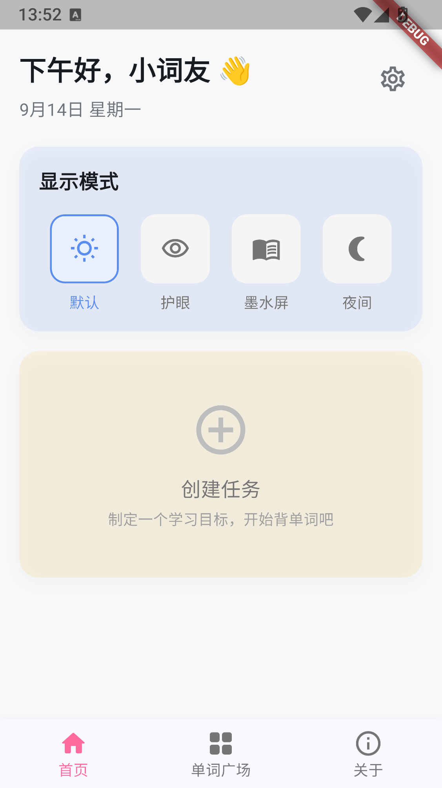 | 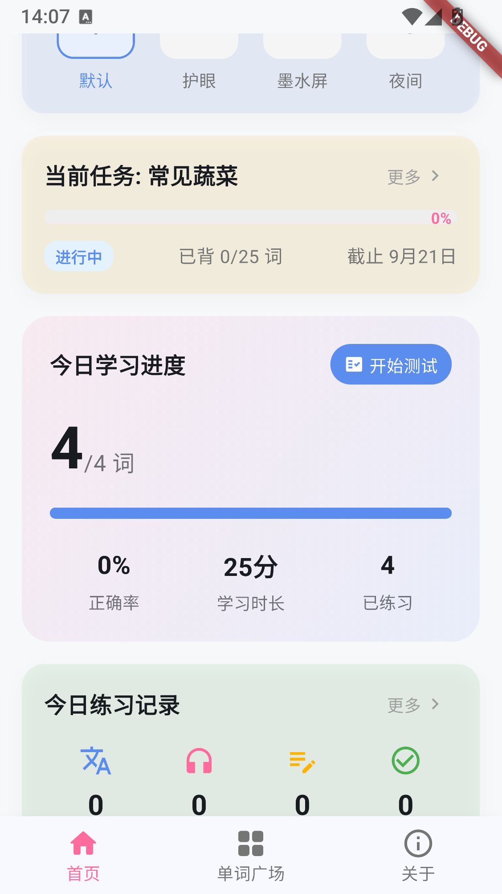 |  |

| 全部分类 | 分类单词列表 | 创建任务 |
|:---:|:---:|:---:|
|  | 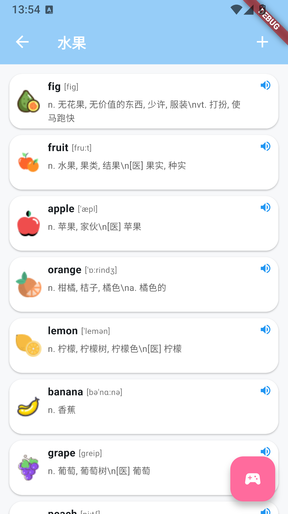 | 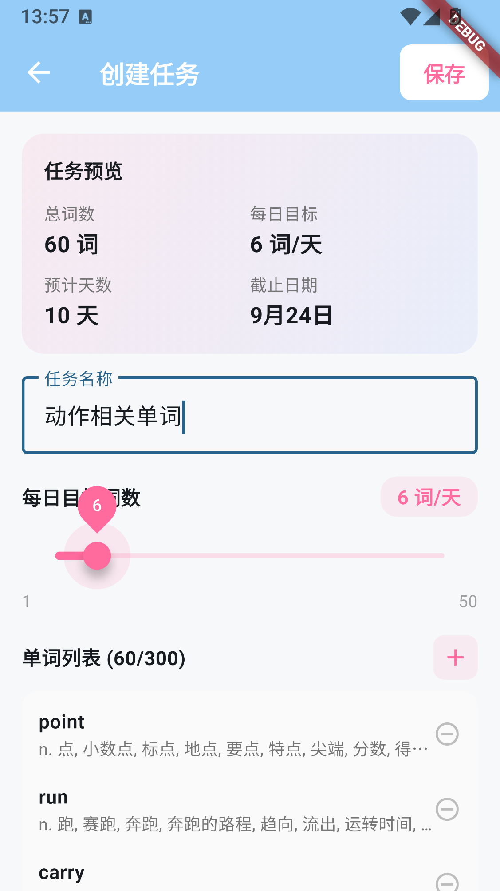 |

| 单词练习 | 今日单词 | 单词消消乐 |
|:---:|:---:|:---:|
| 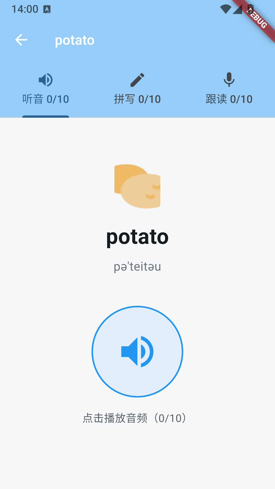 | 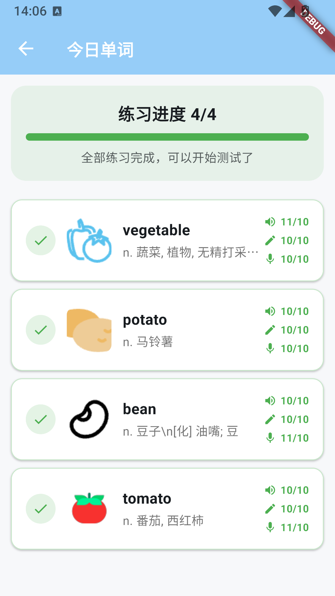 | 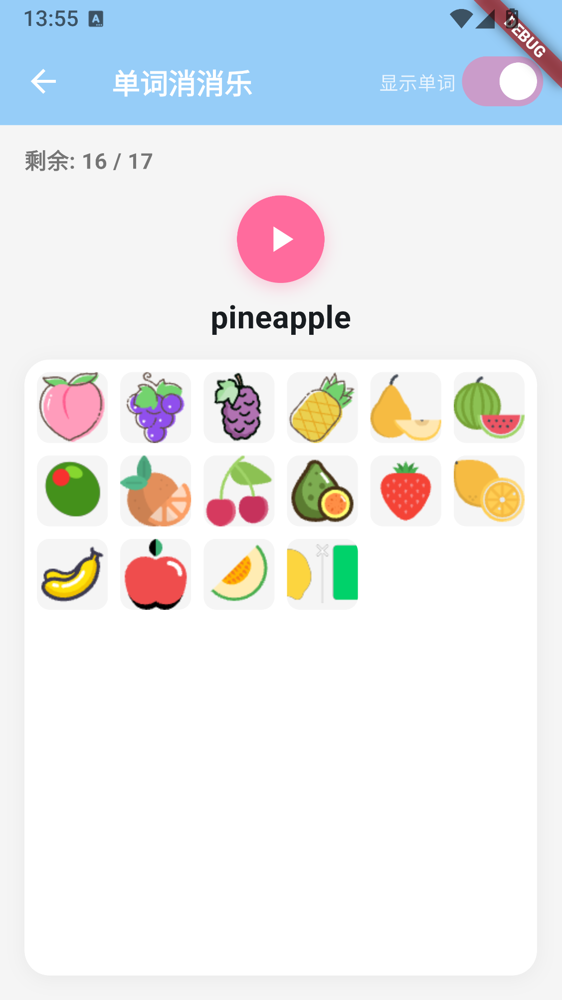 |

| 默写测试 | 测试结果 | 练习记录 |
|:---:|:---:|:---:|
|  | 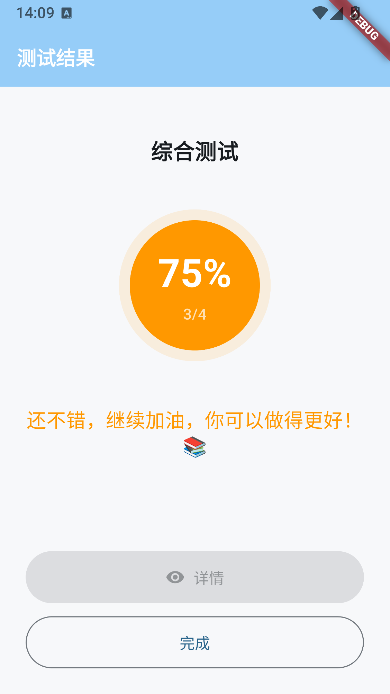 |  |

## 服务端

服务端基于 **Rust + [axum](https://github.com/tokio-rs/axum)** 实现，为客户端提供词库分发与静态资源托管。

### 接口

| 接口 | 说明 |
|------|------|
| `GET /api/version?version_code={n}` | 词库版本检查。读取 `version_info` 表的最新版本号与客户端对比，返回是否有更新及更新内容 |
| `GET /api/download` | 词库下载。返回完整的 `vocabulary_study.db` 文件，客户端下载后替换本地词库 |
| `POST /api/word/image` | 单词图片上传。以 multipart 接收 `word_id` 与 `file`，将裁剪后的 PNG 写入 `resources/pic`，同时更新词库中的图片字段 |
| `GET /resources/{filename}` | 静态资源托管。提供单词图片与音频文件，由客户端按需加载 |

### 配置

服务端通过环境变量配置，未设置时使用默认值：

| 环境变量 | 默认值 | 说明 |
|---------|--------|------|
| `HOST` | `0.0.0.0` | 监听地址 |
| `PORT` | `3002` | 监听端口 |
| `DB_PATH` | `sqlite/vocabulary_study.db` | 词库数据库路径 |
| `RESOURCES_DIR` | `resources` | 静态资源目录 |
| `DB_VERSION` | `1.0.0` | 词库版本号 |

### 运行

```bash
cd server--rust
cargo build --release
cd target/release
./wordtool-server          # Linux / macOS，Windows 下为 wordtool-server.exe
```

运行目录下需包含词库与资源目录：

```
target/release/
├── wordtool-server(.exe)
├── sqlite/
│   └── vocabulary_study.db   # 词库数据库
└── resources/
    ├── pic/                  # 单词图片
    └── audio/                # 单词音频
```

### 运行截图

| 启动服务 | 词库数据库 |
|:---:|:---:|
| 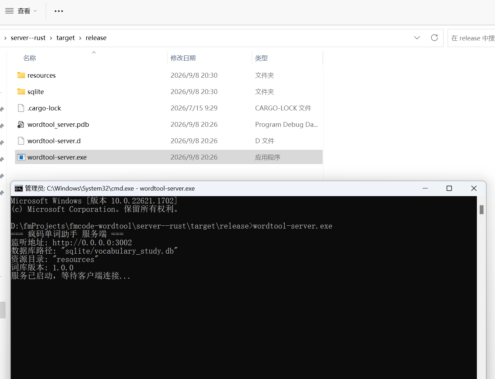 | 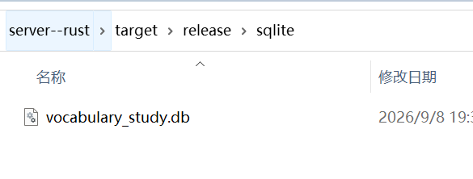 |

| 图片资源目录 | 音频资源目录 |
|:---:|:---:|
| 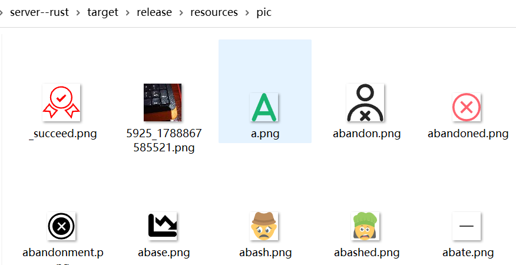 | 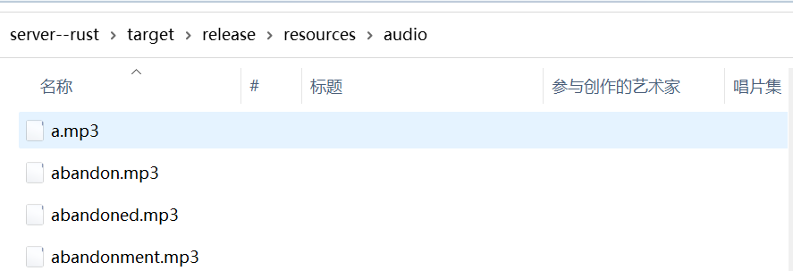 |

### 客户端连接自建服务端

如果你自己部署了服务端，可以在客户端「首页右上角设置 → 服务器地址」中填写自己启动的服务地址（例如 `http://192.168.1.60:3002`），点击「测试连接」确认连通后保存。修改后所有接口请求都会使用新地址；客户端默认连接 `https://wt.fmcode.top`。

| 服务器地址 |
|:---:|
|  |

## 安装说明

1. 确保已安装 [Flutter](https://docs.flutter.dev/get-started/install) 环境
2. 克隆仓库后执行：
   ```bash
   flutter pub get
   flutter run
   ```
3. 打包发布：
   ```bash
   flutter build apk        # Android
   flutter build ios        # iOS（需 macOS + Xcode）
   flutter build windows    # Windows
   flutter build macos      # macOS
   ```

## 直接下载

| 扫码下载 |
|:---:|
|  |

## 音频下载

应用使用的单词音频由**阿里云百炼（CosyVoice）**语音合成模型生成，可通过以下网盘下载：

| 百度网盘 | 夸克网盘 |
|:---:|:---:|
| 音频资源 | 音频资源 |
| [打开链接](https://pan.baidu.com/s/1dAJIgtLt7IIegjy9dDSRtA?pwd=3dr2) | [打开链接](https://pan.quark.cn/s/017d948ddff6?pwd=iKev) |
| 提取码: `3dr2` | 提取码: `iKev` |

## 数据来源与说明

| 内容 | 来源 | 是否提供下载 |
|------|------|------------|
| 单词数据 | 整理自开源英汉词典项目 [ECDict](https://github.com/skywind3000/ECDict)（MIT 协议），含音标、释义、柯林斯/牛津标注、BNC/COCA 词频等 | 随词库分发 |
| 单词音频 | 使用阿里云百炼（CosyVoice）模型合成 | 提供，见上方「音频下载」 |
| 单词图片 | 测试阶段从网络获取，仅用于功能测试与演示 | **不提供下载** |

> 项目中所使用的图片仅用于功能测试与演示，版权归原作者所有，本项目不分发、也不提供下载。正式使用请自行替换为拥有合法授权的素材。

## 联系方式

如有问题或建议，欢迎通过以下方式联系：

| 微信 | QQ |
|:---:|:---:|
|  |  |

## 技术栈

### 客户端（Flutter）

- [Flutter](https://flutter.dev/) - 跨平台 UI 框架
- [sqflite](https://pub.dev/packages/sqflite) - 本地 SQLite 数据库
- [dio](https://pub.dev/packages/dio) - HTTP 请求
- [audioplayers](https://pub.dev/packages/audioplayers) - 音频播放
- [record](https://pub.dev/packages/record) - 录音（跟读练习）
- [cached_network_image](https://pub.dev/packages/cached_network_image) - 网络图片加载与缓存
- [image_picker](https://pub.dev/packages/image_picker) - 图片选择 / 拍照
- [image](https://pub.dev/packages/image) - 图片裁剪
- [shared_preferences](https://pub.dev/packages/shared_preferences) - 本地键值存储
- [permission_handler](https://pub.dev/packages/permission_handler) - 权限申请

### 服务端（Rust）

- [axum](https://github.com/tokio-rs/axum) - Web 框架
- [tokio](https://tokio.rs/) - 异步运行时
- [rusqlite](https://github.com/rusqlite/rusqlite) - SQLite 访问
- [tower-http](https://github.com/tower-rs/tower-http) - 静态资源托管与 CORS
- [serde](https://serde.rs/) / [serde_json](https://github.com/serde-rs/json) - 序列化

## 声明

本项目基于 [Boost Software License 1.0](LICENSE) 开源，允许自由使用、修改与商用（含闭源分发）。分发时请保留原始版权声明与许可声明，详见 [LICENSE](LICENSE)。
